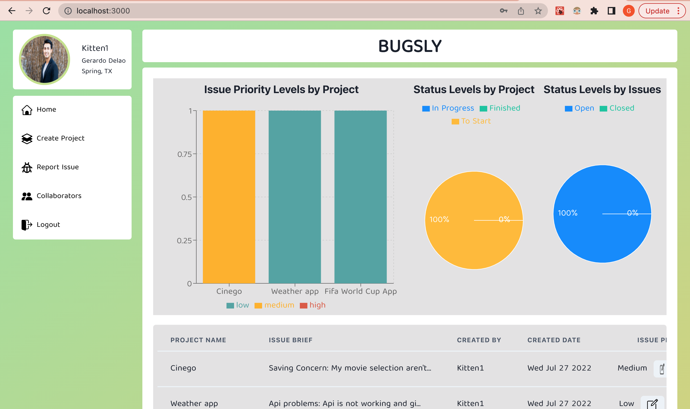
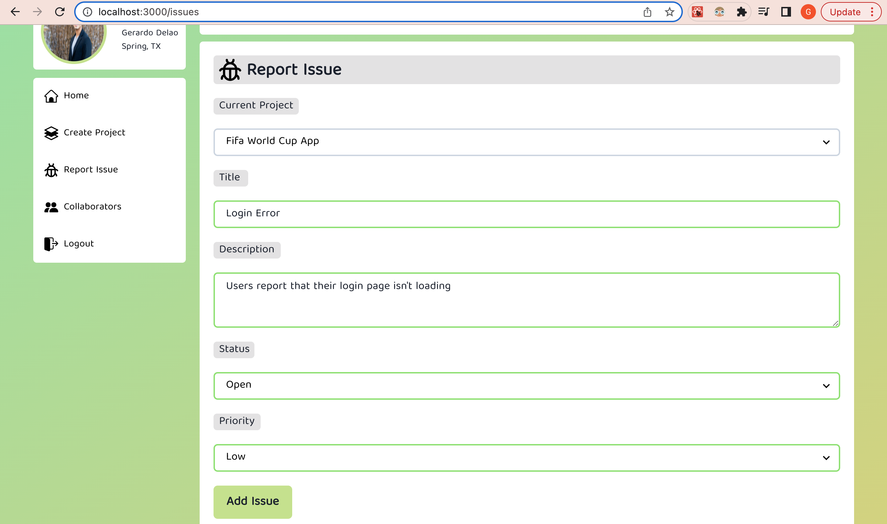
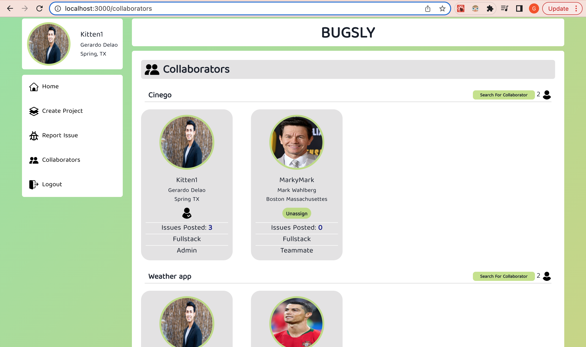

# BUGSLY

A bug tracking app that allows users to keep track of issues found in their projects.

# A preview of Bugsly

**Main Login Page where users can either login/register.**


**Once logged in, users will be redirected to the main dashboard which shows all information about their current projects/issues.**


**If the user is new or wanting to add a new project, they can create a new project with details about it such as description, status and position picking for yourself.**


**Once a project has been created, users will then be able to give a briefing of their projects issue.**


**Once users submit their project issues, they can add other users to specific projects to work on**



# Team Members
* Gerardo Delao
* Myles DeBoer
* Daniel Lee

## Backend
* Node
* Express
* Sequelize
* Postgres

## Frontend
* React
* React Router
* HTML5
* Chakra UI


## Getting Started

Once you have created a new repository with this project, you will want to install
the packages using npm:

```
npm install
```

Next, you will want to configure the `.env` file to match your development
settings. To start, you can create a copy of the `.env.example` file and then
edit the settings inside:

```
cp .env.example .env
```

After this you will want to initialise the database with the settings you edited
in the `.env` file. You can do this using the `db:init` script:

```
npm run db:init
```

Finally, to start the project, you can use the `dev` script. This has been
configured to automatically start both the frontend and backend simultaneously.

```
npm run dev
```

### ESLint and Type Checking
This project has been configured with ESLint and Type Checking using the
Typescript engine. This will add extra debugging hints and handle some common
pitfalls while you develop. It is recommended that you install the recommended
extensions for VSCode to make your development experience smoother.

The configured settings are intentionally strict. You do not have to use them if
you find them too restrictive. To disable the settings, simple delete the
`jsconfig.json` files from the project root and the client folder. You may also
want to disable the ESLint extension. This is not recommended but it will make


### Routing
React Router is what is installed. The
backend is configured to pass all requests that don't match API routes to the
index page so that the client routing solution can handle missing page requests.

### Authentication
The backend has been configured with `express-session` and
`connect-session-sequelize` so that session authentication can be set up.

There is already a User model created that requires an email and a password. It
is configured to work with the `routes/users.js` router which handles user
registration, login, and logout. It will save the user to the active session and
serialize it with the Sequelize model so that you can access related models with
any authenticated request.

If you wish to modify this model, you will need to update three files: the
migration, the model, and the type definition in `./types.d.ts`.

#### A note on JWT
Since the frontend and backend are combined into a single app, there is no need
for token based authentication such as JWT, though it can be added if desired.

### Hosting
This project is set up so that it can be deployed to a single hosting solution.
It will work with an AWS EC2 Instance, though something a little more simple like
Heroku or Railway is probably recommended for simplicity in automatic deployment.
